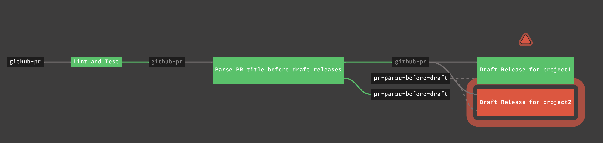
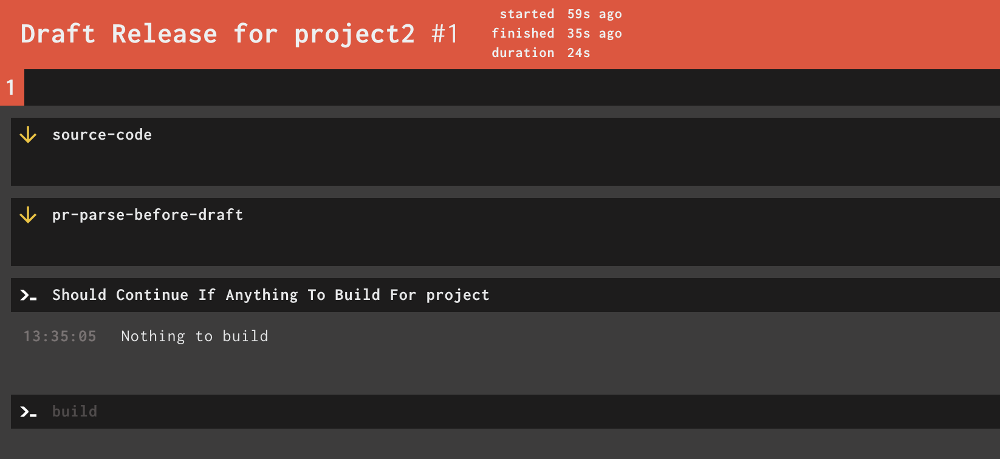
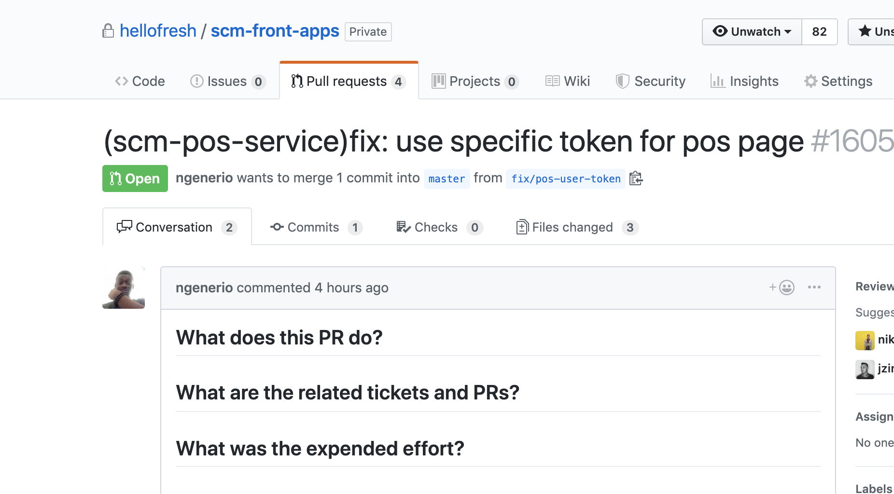
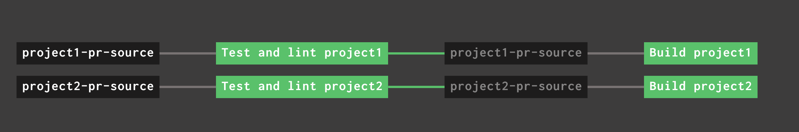

import { Head } from 'mdx-deck'
import { Appear } from 'mdx-deck'
import { CodeSurfer } from 'mdx-deck-code-surfer'
import { FullScreenCode, Split, Horizontal } from 'mdx-deck/layouts'

<Head>
  <title>Monorepo trigger concourse resource</title>
</Head>

# Monorepo concourse resource

export { default as theme } from 'mdx-deck/themes'

---

# Intro

* `scm-front-apps` is a 20+ projects monorepo
* we use Concourse for CI since the beginning
* Concourse work perfectly with one-project repos

---

## Background

* we were experimenting a lot with "standard" means
* we had a few iterations of pipelines
* there are no good resources for monorepos

---

<FullScreenCode>

### How it was before:



</FullScreenCode>

---

<FullScreenCode>



</FullScreenCode>

---

## What we want

* independent workflows for projects
* clear statuses of jobs

---

## Concourse resource 101

* `check` step
* `in` step
* `out` step

---

## Technical details

```
resources:
-   name: project1-pr-source
    type: monorepo-trigger
    source:
        repo: scm-front-apps
        project_name: project1
        strategy: title
        mode: pr

-   name: project1-master-source
    type: monorepo-trigger
    source:
        repo: scm-front-apps
        project_name: project1
        strategy: title
        mode: master

```
---

<FullScreenCode>

### title example:



</FullScreenCode>


---

<FullScreenCode>

### before:


### after:



</FullScreenCode>

---

## Pros and cons

---

# Plans

* Front-end v2 <a href='https://github.com/hellofresh/rfc/pull/203' target='_blank'>RFC</a>
* finish a <a href='https://github.com/hellofresh/monorepo-trigger-concourse-resource/pull/27' target='_blank'>blog post</a> about it
* open source <a href='https://github.com/hellofresh/monorepo-trigger-concourse-resource' target='_blank'>the project</a>
